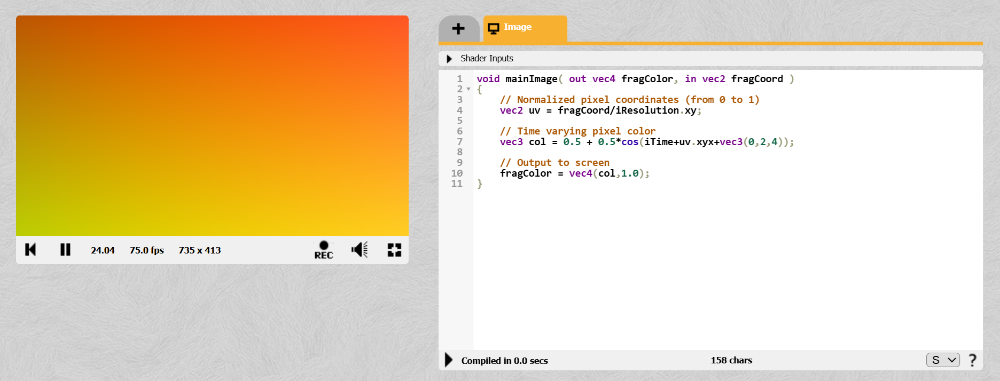
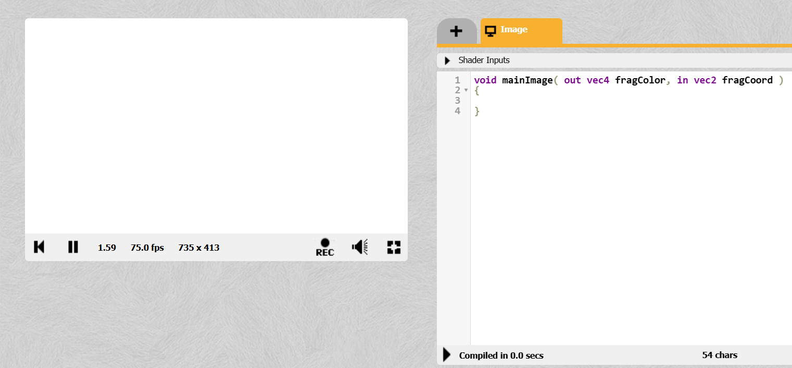
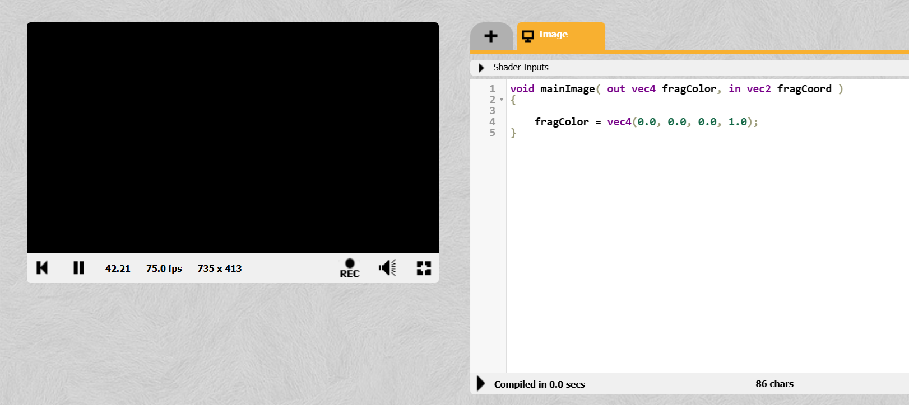
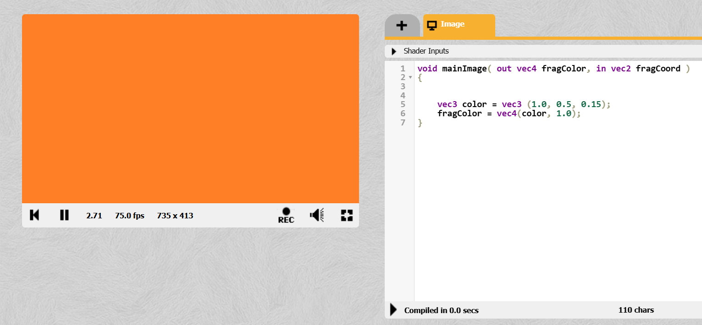

# ЛАБОРАТОРНАЯ РАБОТА №1. Основы ShaderToy: От пикселя к изображению
🔝 [Все практические работы](../README.md)  
🔜 Геометрия экрана: Системы координат, линии и сетки
***

## Содержание

🔍 [Теория](#Теория)  
💡 [Полезные ссылки](#Полезные-ссылки)  
⚔️ [Учебная задача](#Учебная-задача)  
📋 [Задания](#Задания)  
🚩 [Контрольные вопросы](#Контрольные-вопросы)

*** 

## Теория

В компьютерной графике **шейдер** — это программа, выполняемая на видеокарте (GPU), которая рассчитывает цвет каждого пикселя на экране. В отличие от традиционного программирования, где вы управляете логикой приложения, здесь вы пишете код, который работает **параллельно** для миллионов пикселей.

ShaderToy — это интерактивная онлайн-платформа для написания шейдеров прямо в браузере. Она использует язык **GLSL** (OpenGL Shading Language). Ваш код работает во фрагментном шейдере (pixel shader), главная задача которого — вернуть цвет (`fragColor`) для текущего обрабатываемого пикселя.

Цвет представляется в виде вектора из четырех компонентов типа `vec4`:
* R — красный канал (от 0.0 до 1.0)
* G — зеленый канал (от 0.0 до 1.0)
* B — синий канал (от 0.0 до 1.0)
* A — альфа-канал (прозрачность, от 0.0 до 1.0)

Например, `vec4(1.0, 0.0, 0.0, 1.0)` — непрозрачный красный цвет.

## Полезные ссылки

1. [Официальный сайт OpenGL](https://www.opengl.org/)
2. [Документация ShaderToy](https://www.shadertoy.com/howto)
3. [Старенькая, но вполне полезная статья на хабре по шейдерам на ShaderToy](https://habr.com/ru/articles/333002/)

## Учебная задача

Первым делом перейдите на [ShaderToy.com](https://www.shadertoy.com/)


Чтобы создать новый холст нажмите **```New```** вверху справа.  

> Также рекомендуется зарегистрироваться (**```Sign In -> Create Account```**), чтобы иметь возможность сохранять прогресс.


Откроется вот такое окно создания шейдера:



Справа вы пишете _код_, а слева выводится _**результат**_. 

> На сайте _ShaderToy_ реализован **фрагментный шейдер**, единственной задачей которого является возвращение четырёх чисел для каждого пикселя на экране: **r**, **g**, **b**, **a**. 

Точкой входа является функция **`mainImage`**, которая принимает два аргумента:  
* `out vec4 fragColor` - цвет пикселя (_**r, g, b, a**_)
* `in vec2 fragCoord` -  координаты пикселя на экране (_**x, y**_)

> `vec2`, `vec4` - это векторы соответствующего размера.  
`out` - ключевое слово, которое позволяет передавать аргумент по ссылке (другими словами, откуда-то извне передаётся вектор и его значения напрямую меняются в теле функции **`mainImage`**).

При создании нового шейдера `ShaderToy` любезно показывают приветственный переливающийся градиент. 


> Красиво, но пока что слишком сложно для понимания. Мы обязательно к нему вернемся в будущем, а начнем с чего-нибудь попроще.

Начнем с белого листа. Для этого удалите всё, что находится между фигурных скобок `{}` и добавьте следующую инструкцию:  
`fragColor = vec4(1.0, 1.0, 1.0, 1.0);`
```C++
void mainImage( out vec4 fragColor, in vec2 fragCoord )
{
    fragColor = vec4(1.0, 1.0, 1.0, 1.0);
}
```  
Затем нажмите на стрелку, чтобы скомпилировать код:


Получится вот так:



> Если оставить просто пустые фигурные скобки `{}` в функции `mainImage`, то также будет белый экран.

Давайте рассмотрим инструкцию `fragColor = vec4(1.0, 1.0, 1.0, 1.0);`:

* `fragColor` - это тот самый аргумент, который по ссылке передаётся в главную функцию, т.е. **цвет пикселя**.
* `vec4(1.0, 1.0, 1.0, 1.0)` - четырёхкомпонентный вектор (**rgba**).
* `;` - каждая инструкция должна заканчиваться точкой с запятой, чтобы компилятор мог понять, что это конец инструкции.

> Напомню, что  **rgba** - это **r**ed, **g**reen, **b**lue, **a**lpha. Первые три компоненты - это сам цвет, получаемый из соотношения трёх цветовых каналов, а _alpha_ - это прозрачность. В `ShaderToy` _прозрачность_ игнорируется, но как аргумент передаваться должна.

Каждая цветовая компонента _rgba_ принимает значение от **0.0** до **1.0**. И, как можно заметить, это **float**. 

Соответственно, чтобы получить _белый цвет_, то в каждый канал нужно передать максимум (по **1.0)**, а чтобы получить _чёрный цвет_ - передать нули (**0.0**).

```C++
void mainImage( out vec4 fragColor, in vec2 fragCoord )
{
    fragColor = vec4(0.0, 0.0, 0.0, 1.0);
}
``` 

Результат:



На самом деле, можно сделать вот так и получить такой же результат:
```C++
void mainImage( out vec4 fragColor, in vec2 fragCoord )
{

    vec3 color = vec3(0.0, 0.0, 0.0);
    fragColor = vec4(color, 1.0);
}
```

Теперь попробуем получить какой-нибудь другой цвет, например, вот такой:
```C++
void mainImage( out vec4 fragColor, in vec2 fragCoord )
{

    vec3 color = vec3(1.0, 0.5, 0.15);
    fragColor = vec4(color, 1.0);
}
```


> На самом деле, в вектор можно передавать и **целые** числа, и даже числа, выходящие за границы диапазона `[0.0; 1.0]`. Если передать, например, `-100`, то это всё равно будет `0.0`, как и с большим положительным числом (например, `300`) - это будет `1.0`. 

Теперь это можно всё объединить в один исходник и при необходимости закомментировать определённые участки кода (например, чтобы вывести белый цвет нужно закомментировать строку `color = vec3 (1.0, 0.5, 0.15);`)

```C++
void mainImage( out vec4 fragColor, in vec2 fragCoord )
{

    //черный цвет
    vec3 color = vec3 (0.0, 0.0, 0.0);
    
    //белый цвет
    color = vec3 (1.0, 1.0, 1.0);
    
    //кое-что между черным и белым
    color = vec3 (1.0, 0.5, 0.15);
    
    fragColor = vec4(color, 1.0);
}
```

А для самых смелых есть вариант с макросами:
```C++
//Выберите нужное задание (от 0 до 2) и вставьте после SOLID_COLOR (не забудьте скомпилировать после изменений)
#define SOLID_COLOR 0

/* СПИСОК ЗАДАНИЙ
0 Черный цвет
1 Белый цвет
2 Какой-то цвет
*/

#if SOLID_COLOR == 0
// BLACK COLOR
void mainImage( out vec4 fragColor, in vec2 fragCoord )
{
    vec3 color = vec3 (0.0, 0.0, 0.0);
    fragColor = vec4(color, 1.0);
}

#elif SOLID_COLOR == 1
// WHITE COLOR
void mainImage( out vec4 fragColor, in vec2 fragCoord )
{
    vec3 color = vec3 (1.0, 1.0, 1.0);
    fragColor = vec4(color, 1.0);
}

#elif SOLID_COLOR == 2
//SOME COLOR
void mainImage( out vec4 fragColor, in vec2 fragCoord )
{
    vec3 color = vec3 (1.0, 0.5, 0.15);
    fragColor = vec4(color, 1.0);
}
#endif
```

## Задания


### Задание 1. Подготовка

Перейдите на сайт [ShaderToy.com](https://www.shadertoy.com/) и создайте новый шейдер.

### Задание 2. Сплошной цвет

Поочередно залейте экран чёрным, белым и любым понравившимся вам цветом между черным и белым.


## Контрольные вопросы

1. Дайте определение шейдера. Чем шейдерная программа фундаментально отличается от классического (CPU) программирования?
2. Как представлен цвет в GLSL? Назовите тип данных и компоненты вектора.
3. Как получить белый, черный и серый цвета? Как получить желтый цвет?
4. Что такое фрагментный шейдер (fragment/pixel shader) и какова его основная задача?
5. Что представляет собой альфа-канал (A) и как он работает на ShaderToy?