# ЛАБОРАТОРНАЯ РАБОТА №2. Геометрия экрана: Системы координат, линии и сетки
🔝 [Все лабораторные работы](../../README.md)  
🔙 [Основы ShaderToy: От пикселя к изображению](../LR1/LR1.md)  
🔜 Рисование фигур: Построение геометрических примитивов и градиентов
***

## Содержание

🔍 [Теория](#Теория)  
💡 [Полезные ссылки](#Полезные-ссылки)  
⚔️ [Учебная задача](#Учебная-задача)  
📋 [Задания](#Задания)  
🚩 [Контрольные вопросы](#Контрольные-вопросы)

*** 

## Теория

**Rasterization (растеризация)** - процесс преобразования векторных графических примитивов (линий, многоугольников) в растровое изображение, состоящее из пикселей.

**Координатная система** - система определения положения точек в пространстве с помощью чисел (координат). В компьютерной графике используются различные системы координат, каждая со своей областью применения.

##### Иерархия координатных систем

1. **Локальная система координат (Object Space)**  

    * *Начало:* Центр объекта

    * *Назначение:* Описание геометрии объекта

    * *Особенности:* Независима от положения объекта в сцене

    * *Пример:* Вершины 3D-модели в файле

1. **Мировая система координат (World Space)**
    * *Начало:* Общая точка мира

    * *Назначение:* Позиционирование объектов в сцене

    * *Преобразование:* Матрица модели (Model Matrix)

1. **Система координат камеры (View Space)**
    * *Начало:* Позиция камеры

    * *Назначение:* Описание сцены относительно камеры

    * *Преобразование:* Матрица вида (View Matrix)

1. **Система отсечения (Clip Space)**
    * *Диапазон:* [-1, 1] по всем осям

    * *Назначение:* Определение видимой области

    * *Преобразование:* Матрица проекции (Projection Matrix)

1. **Нормализованные координаты устройства (NDC)**
    * *Диапазон:* [-1, 1] или [0, 1]

    * *Назначение:* Унификация для различных устройств

1. **Экранные координаты (Screen Space)**  
    * *Начало:* Зависит от API (левый верхний/нижний угол)

    * *Единицы:* Пиксели

    * *Назначение:* Финальное отображение

## Полезные ссылки

1. [Официальный сайт OpenGL](https://www.opengl.org/)
2. [Документация ShaderToy](https://www.shadertoy.com/howto)
3. [Старенькая, но вполне полезная статья на хабре по шейдерам на ShaderToy](https://habr.com/ru/articles/333002/)

## Учебная задача

Начнем с того, что попробуем разделить экран на два цвета. У нас есть вектор `fragCoord`, в котором хранятся координаты пикселя (`x` и `y`).
> Можно сделать так: смотреть чему равна `x`-координата пикселя, и если она меньше, например `100`, то задавать пикселю один цвет, а во всех остальных случаях - задавать другой цвет.  
```C++
void mainImage( out vec4 fragColor, in vec2 fragCoord )
{
    vec3 color1 = vec3(1,0,0);
    vec3 color2 = vec3(1,1,0);
    
    vec3 pixelColor;
    
    float widthOfStrip = 100;
    
    if (fragCoord.x < widthOfStrip) 
    {
        pixelColor = color1;
    }
    else
    {
        pixelColor = color2;
    }
    fragColor = vec4(pixelColor, 1.0);
    
}
```
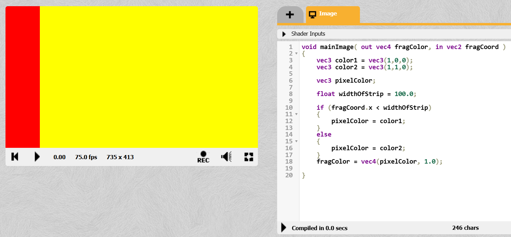

А как поделить экран ровно пополам?

> Во-первых, у нас есть **uniform**-переменные. Это такие глобальные переменные, значение которых является **постоянным на протяжении всего периода рендеринга**. 

Вверху над окном кода есть `Shader Inputs` и там можно посмотреть какие `uniform`-переменные можно использовать

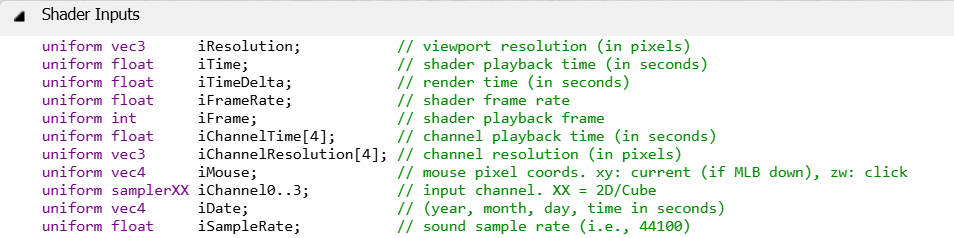 

> Сейчас нас интересует `iResolution`. Это разрешение вьюпорта. Его кстати вы можете увидеть рядом с количеством кадров в секунду ( на скриншоте выше `715x413`).  
*Если вам вдруг в голову придёт мысль порастягивать окно браузера, в котором открыт ShaderToy, то эти цифры будут меняться.*

Логично предположить, что если взять разрешение экрана (например, по координате `x`) и разделить на 2, то получится значение половины экрана
```C++
void mainImage( out vec4 fragColor, in vec2 fragCoord )
{
    vec3 color1 = vec3(1,0,0);
    vec3 color2 = vec3(1,1,0);
    
    vec3 pixelColor;
    
    float widthOfStrip = iResolution.x / 2.0;
    
    if (fragCoord.x < widthOfStrip) 
    {
        pixelColor = color1;
    }
    else
    {
        pixelColor = color2;
    }
    fragColor = vec4(pixelColor, 1.0);
    
}
```
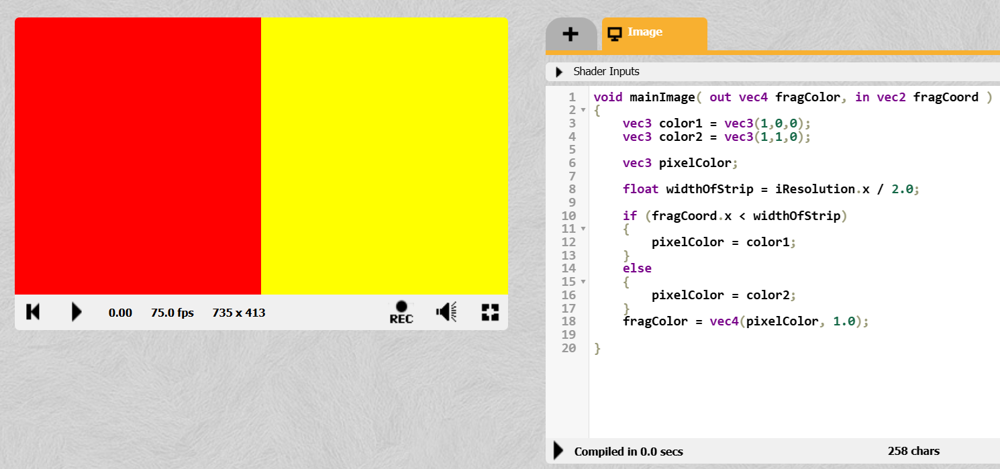

И тогда какого бы размера не был экран, он будет разделен ровно на две части.

> А что если мы не хотим быть привязанными к разрешению? Оно же может быть любое.  
Вот здесь возникает такое понятие как **нормализация**. 

При *нормализации* координаты пикселей вьюпорта любого разрешения ложатся в диапазон `[0.0;1.0]`.
> В то время как без нормализации:  
левый нижний угол: [`0.0`; `0.0`]   
левый верхний угол: [`0.0`; `iResolution.y`]  
правый нижний угол: [`iResolution.x`; `0.0`]  
правый верхний угол: [`iResolution.x`; `iResolution.y`]

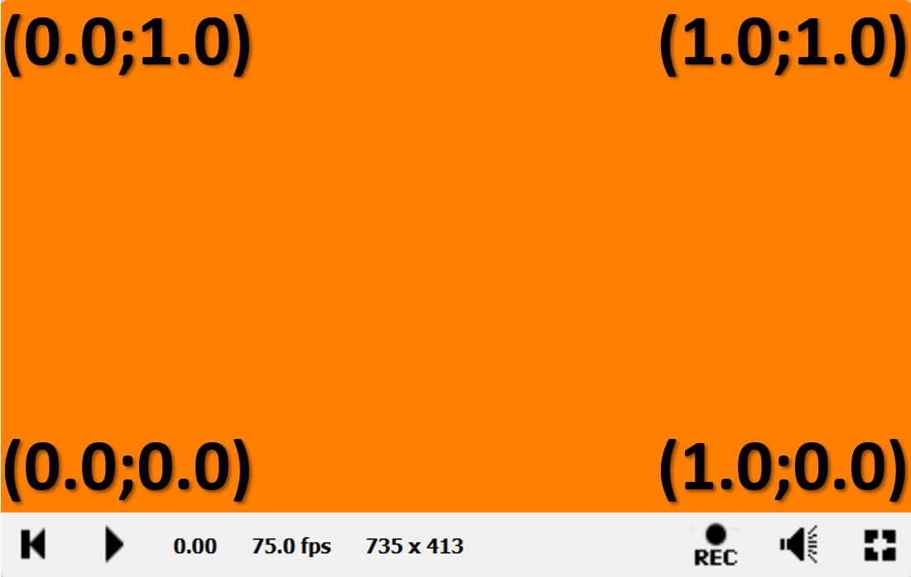

Так как же это нормализовать? 

> Нужно координаты каждого пикселя поделить на разрешение.  
`fragCoord.xy / iResolution.xy;`

```C++
void mainImage( out vec4 fragColor, in vec2 fragCoord )
{
    //нормализация
    vec2 uv = fragCoord.xy / iResolution.xy;
    
    vec3 color1 = vec3(1,0,0);
    vec3 color2 = vec3(1,1,0);
    
    vec3 pixelColor;
    
    float widthOfStrip = 0.5;
    
    // тернарный оператор. По сути, это обычное if...else с одной инструкцией, 
    // только короче
    pixelColor = (uv.x > widthOfStrip) ? color1 : color2;
    
    fragColor = vec4(pixelColor, 1.0);
    
}
```


А как сделать 3 полосы?
> Если мы говорим про 3 полосы одинаковой ширины, то можно диапазон [0.0;1.0] разделить на 3 диапазона и проверять куда попал пиксель

```C++
void mainImage( out vec4 fragColor, in vec2 fragCoord )
{
    //нормализация
    vec2 uv = fragCoord.xy / iResolution.xy;
    
    // массив цветов
    vec3 colors[3]; 
    colors[0] = vec3(0.247,0.388,0.345);
    colors[1] = vec3(0.541,0.6,0.580);
    colors[2] = vec3(0.91,0.694,0.0);
    
    vec3 pixelColor;
    
    float widthOfStrip = 0.333;
    
    if (uv.x < widthOfStrip)
    {
        pixelColor = colors[1];
    }
    else if (uv.x < widthOfStrip * 2.0)
    {
        pixelColor = colors[2];
    }
    else
    {
        pixelColor = colors[0];
    }

    fragColor = vec4(pixelColor, 1.0);
}
```
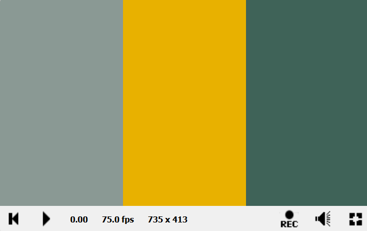

А как сделать горизонтальные полосы?

> Нужно просто координату `x` поменять на `y`.  
`uv.y < widthOfStrip` и `uv.y < widthOfStrip * 2.0`

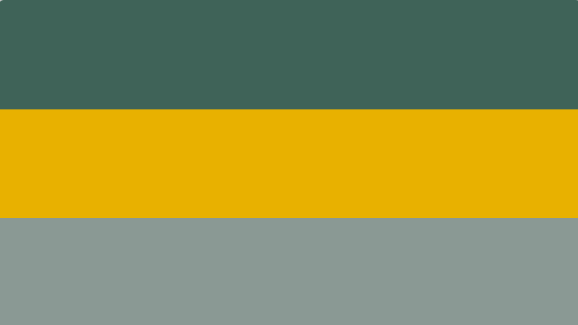

А как сделать 4 полосы? А 5? 

> Можно, конечно, добавлять каждый раз `if..else`, но есть вариант поинтереснее.

``` C++
void mainImage( out vec4 fragColor, in vec2 fragCoord )
{
    //нормализация
    vec2 uv = fragCoord.xy / iResolution.xy;
    
    // Делим пространство по X на 3 сегмента и берём целую часть от 0 до 2
    int bandIndex = int(floor(uv.x * 3.0));
        
    // массив цветов
    vec3 colors[3]; 
    colors[0] = vec3(0.247,0.388,0.345);
    colors[1] = vec3(0.541,0.6,0.580);
    colors[2] = vec3(0.91,0.694,0.0);
    
    // Безопасно выбираем цвет. %3 гарантирует, что индекс всегда будет 0, 1 или 2
    vec3 pixelColor = colors[bandIndex % 3];

    fragColor = vec4(pixelColor, 1.0);    
}
```
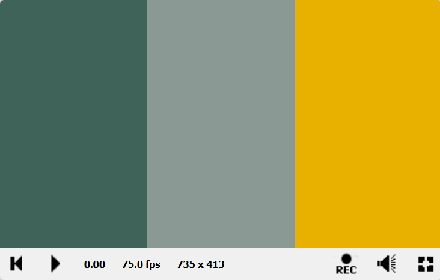

Как это получилось? Давайте рассмотрим вот эту часть:  
`int bandIndex = int(floor(uv.x * 3.0));`

`uv.x * 3.0` - напомню, что диапазон координат [ 0.0; 1.0 ]. Чтобы получить 3 полосы, увеличиваем этот диапазон в 3 раза.  
`floor(uv.x * 3.0)` - функция `floor (x)` возвращает **наибольшее целое число, которое меньше или равно `x`**.  
`int(floor(x))` - хоть `floor` и возвращает наибольшее целое, это число возвращается типа `float`

> Например, `uv.x = 0.35`  
`uv.x * 3.0` = 0.35 * 3.0 = 1.05  
`floor(uv.x * 3.0)` = floor(1.05) = 1.0  
`int(floor(uv.x * 3.0))` = 1

Теперь рассмотрим вот эту часть:  
`vec3 pixelColor = colors[bandIndex % 3];`

`bandIndex % 3` - остаток от деления на 3. Гарантирует, что индекс всегда будет **0**, **1** или **2**. Если `bandIndex` будет равен, например 3, то 3 % 3 = **0**, если будет равен 4, то 4 % 3 = **1**, а если 5, то 5 % 3 = **2**, а если 6, то 6 % 3 = **0**. *Уже улавливаете закономерность?..*

`colors[bandIndex % 3]` - берем цвет по индексу из массива.

А теперь попробуйте вот в этой строчке `int bandIndex = int(floor(uv.x * 3.0));`  
`3.0` увеличить, не меняя больше нигде код. Поставьте, например, 4. Что изменилось? А если 5? Вот что получится, если запустить вот такой код:

``` C++
void mainImage( out vec4 fragColor, in vec2 fragCoord )
{
    //нормализация
    vec2 uv = fragCoord.xy / iResolution.xy;
    
    int bandIndex = int(floor(uv.x * 9.0));
        
    // массив цветов
    vec3 colors[3]; 
    colors[0] = vec3(0.247,0.388,0.345);
    colors[1] = vec3(0.541,0.6,0.580);
    colors[2] = vec3(0.91,0.694,0.0);
    
    // Безопасно выбираем цвет. %3 гарантирует, что индекс всегда будет 0, 1 или 2
    vec3 pixelColor = colors[bandIndex % 3];

    fragColor = vec4(pixelColor, 1.0);    
}
```
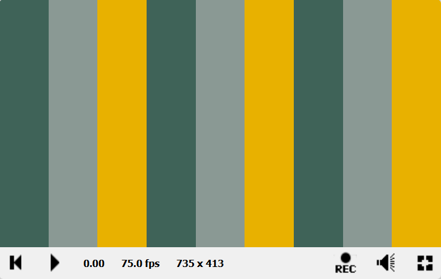

У нас получился повторяющийся паттерн! И элегантный код😄 .

Во всех примерах до этого полосы заполняют весь экран. А как нарисовать тонкую линию на белом фоне? Например, вот такую:

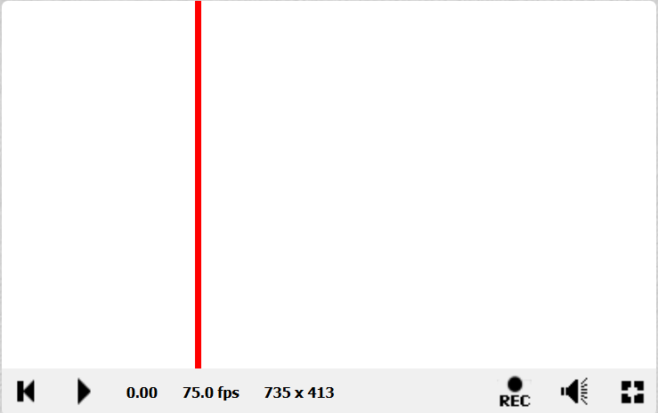

Давайте рассмотрим вот с такой стороны:

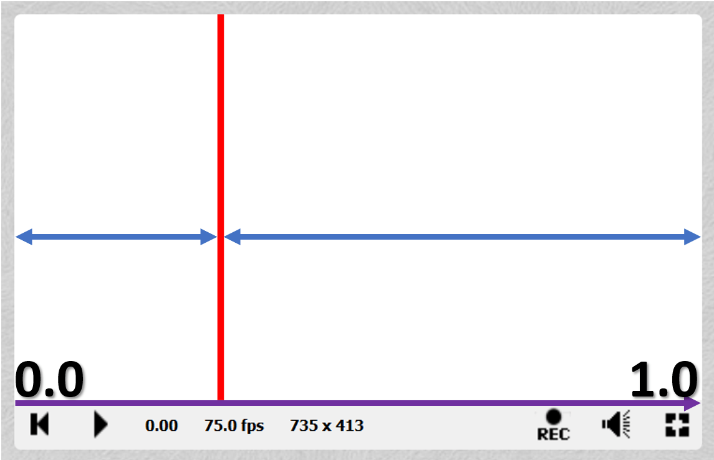


Фиолетовая линия - это ось `X`. Т.к. мы всегда теперь будет нормализовывать координаты пикселей, то `x` будет лежать в диапазоне от `0.0` до `1.0`.

> При условии, что начало координат `(0.0;0.0)` находится в **левом нижнем углу**.   
*В дальнейшем начало координат мы часто будет сдвигать в центр экрана, но об этом в следующих лабораторных работах*😉

Координату `y` в данном случае мы будем игнорировать, потому что линия строго вертикальная.

Соответственно, рассмотрим координату `x`. Во-первых, у линии есть **толщина** и **положение**. Предположим, что:  
```C++
lineThickness = 0.01;
lineCoord = 0.3;
```

Т.е., `x = 0.3`, это первая слева треть экрана.

Теперь, чтобы нарисовать линию, нужно *все пиксели*, которые **не попадают в эту линию** закрасить *цветом фона*, а те, что **попадают** - *цветом линии*.  

А вот как понять что пиксель попал в линию?

1. Можно посчитать диапазон `[0.3-0.01; 0.3+0.01]` и проверять попадание в него.
> Т.е. ***логическое И*** того, что координата пикселя больше или равно `a (0.3-0.01)` и меньше или равно `b (0.3+0.01)`.

2. Посчитать **разницу** между *координатой пикселя* и *координатой линии* и взять от этого **модуль**, т.к. нам нужно именно расстояние. А затем сравнить это с толщиной линии и **если разница меньше толщины линии, то пиксель попал в линию**.

> Т.е. `abs (uv.x - lineCoord) < (lineThickness * 0.5)`  
*Почему толщину линии (`lineThickness`) нужно умножить на 0.5 (т.е. поделить на 2)?*


```C++

void mainImage( out vec4 fragColor, in vec2 fragCoord )
{

    vec2 uv = fragCoord.xy / iResolution.xy;
    
    //Белый фон
    vec3 finalColor = vec3(1.0);
    
    //Цвет линии
    vec3 lineColor = vec3(1.0, 0.0, 0.0);
    
    //Толщина линии
    float lineThickness = 0.01;
    
    
    float lineCoord = 0.3;
    
    if (abs(uv.x - lineCoord) < (lineThickness * 0.5) )
    {
        finalColor = lineColor;
    }
    

    fragColor = vec4(finalColor, 1.0);
}
```


> Обратите внимание, что цвет можно задать вот так:  
`vec3(1.0);` и это белый цвет.  
Вопрос для размышления: *А как таким образом задать черный цвет? А серый?*

А как нарисовать еще одну линию рядом (1)? А если горизонтальную (2)? 

(1) Можно добавить по `else if` для каждой другой линии.  

(2) Нужно у пикселя брать не `x`, а координату `y` и все эти манипуляции проводить с ней, игнорируя `x`.

> Эти варианты попробуйте сделать самостоятельно, чтобы лучше понять как это работает. 

У варианта с `else if` есть существенные недостаток: по сути, это **один и тот же код, но с разными параметрами**. Т.е. это можно свернуть в **функцию**.

Чтобы нарисовать линию нам нужно знать:
1. Координаты начала линии `(x,y)`, т.е. `vec2`;
2. Координаты конца линии `(x,y)`, т.е. `vec2`;
3. Толщину линии, т.е. `float`;
4. Цвет линии, т.е. `vec3`.
 

##### Математический подход к рисованию линии


Математический подход основан на вычислении **расстояния от текущей точки до бесконечной прямой**, проходящей через заданные точки начала и конца линии. Если это расстояние меньше половины толщины линии - мы закрашиваем пиксель.

Концепция вот такая: **функция принимает**:
1. Координаты пикселя (`vec2 pixelCoords`)
2. Координаты начала вектора (`vec2 start`)
3. Координаты конца вектора (`vec2 end`)
4. Толщину линии (`float thickness`)
5. Цвет линии (`vec3 lineColor`)
6. Цвет фона (`vec4 bgColor`)

**Функция возвращает** **четырёхкомпонентный вектор** (*цвет + прозрачность*) `vec4`.

Теперь идём по такому алгоритму:

1. Получаем вектор линии (*вычитаем из координат конца координаты начала*)  
`vec2 lineVec = end - start;`
> Мы находим вектор, который показывает направление и длину нашей линии. Если `start = (0,0)` и `end = (3,4)`, то `lineVec = (3,4)`.

2. Нормализуем 
```C++
float lineLength = length(lineVec);
vec2 lineDirection = lineVec / lineLength;
```
> Длина вектора `(3,4)` равна 5. Нормализация делит каждую компоненту на длину:
`(3/5, 4/5) = (0.6, 0.8)`. Теперь это **единичный вектор** (длина = 1), показывающий только направление.

3. Находим нормаль (перпендикуляр)  
`vec2 normal = vec2(-lineDirection.y, lineDirection.x);`  

Для вектора `(0.6, 0.8)` нормаль будет (`-0.8, 0.6)`.  

**Почему?** Поворот на 90 градусов против часовой стрелки:
* x' = -y
* y' = x  

*Проверка:* скалярное произведение `(0.6,0.8) · (-0.8,0.6) = -0.48 + 0.48 = 0` - векторы перпендикулярны!

4. Вычислим расстояние до прямой  
`float dist = abs(dot(pixelCoords - start, normal));`

Разберем по частям:

* `pixelCoords - start` - вектор от начала линии до текущей точки

* `dot(..., normal)` - проекция этого вектора на нормаль

* `abs()` - берем модуль, так как расстояние всегда положительное

Геометрический смысл: Скалярное произведение `dot(A, B)` равно `|A| × |B| × cos(θ)`, где θ - угол между векторами. Так как `|normal| = 1`, то `dot(A, normal) = |A| × cos(θ)` - это и есть расстояние до прямой!

5. Сравниваем расстояние с толщиной линии
```C++
if (dist < thickness * 0.5)
    {
        bgColor = vec4(lineColor,1.0);
    }
```
> Если попали в линию, то нужно вернуть цвет линии

6. Возвращаем цвет  
`return bgColor;`

> Если пиксель не попал в линию, то остаётся тот же цвет фона, что и пришёл, а если попал, то на 5-ом шаге лежит уже цвет линии

7. Вызываем функцию из `mainImage`

```C++
    fragColor = drawLine (uv, vec2(0.3,0.0), vec2(0.3,1.0), 0.01, vec3(0.0), vec4(1.0));
    fragColor = drawLine (uv, vec2(0.0,0.3), vec2(1.0,0.3), 0.02, vec3(1.0,0.0,0.0), fragColor);
```

> Обратите внимание на последний аргумент `bgColor`. В первый раз передаётся просто вектор с белым цветом, а во второй (и последующие) уже сам `fragColor`. 

```C++

vec4 drawLine (vec2 pixelCoords, vec2 start, vec2 end, float thickness, vec3 lineColor, vec4 bgColor)
{
    //вычисляем вектор и находим его длину
    vec2 lineVec = end - start;
    float lineLength = length(lineVec);
    
    //нормализуем вектор и находим перпендикуляр (нормаль)
    vec2 lineDirection = lineVec / lineLength;
    vec2 normal = vec2(-lineDirection.y, lineDirection.x);
    
    //вычисляем расстояние пикселя до прямой
    float dist = abs(dot(pixelCoords - start, normal));
    
    if (dist < thickness * 0.5)
    {
        bgColor = vec4(lineColor,1.0);
    }

    return bgColor;
}

void mainImage( out vec4 fragColor, in vec2 fragCoord)
{
    // Normalized pixel coordinates (from 0 to 1)
    vec2 uv = fragCoord/iResolution.xy;

    fragColor = drawLine (uv, vec2(0.3,0.0), vec2(0.3,1.0), 0.01, vec3(0.0), vec4(1.0));
    fragColor = drawLine (uv, vec2(0.0,0.3), vec2(1.0,0.3), 0.02, vec3(1.0,0.0,0.0), fragColor);
    fragColor = drawLine (uv, vec2(0.0,0.2), vec2(1.0,0.8), 0.03, vec3(1.0,1.0,0.0), fragColor);
    fragColor = drawLine (uv, vec2(0.5,0.5), vec2(0.9,0.1), 0.04, vec3(1.0,0.6,0.1), fragColor);

}
```
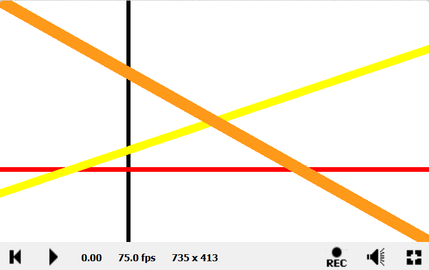

> Обратите внимание, что линии накладываются друг на друга. *От чего это зависит?*

 **А как получить вот такие линии?** *А это вы узнаете в следующей лабораторной работе*😏 

*Подсказка:*
```
vec3(1.0,uv.x,uv.y)
vec3(uv.y,uv.x,1.0)
vec3(uv.x,0.1,uv.y)
vec3(uv.y,uv.y,0.2)

vec4(uv.x,uv.y,uv.y,1.0)
```

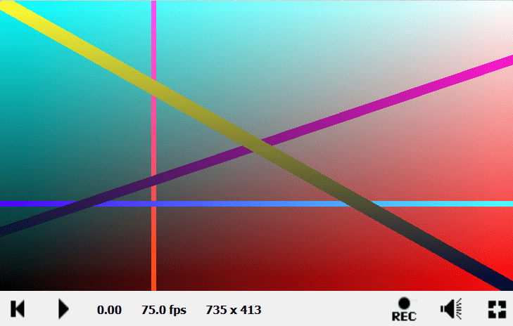

## Задания

### Задание 1. Полоски

Сделайте несколько полосок разного цвета. Горизонтальные и вертикальные.

### Задание 2. Линии

Нарисуйте линии разной толщины и цвета.

### Задание 3. Сетка

Сделайте координатные оси с засечками и/или сеткой.


## Контрольные вопросы

1. Что такое система координат в компьютерной графике?

2. Как преобразовать координаты из экранной системы в нормализованную?

3. Опишите математический принцип построения линии по двум точкам.
 
4. Что такое нормаль к прямой и как ее вычислить?

5. Объясните принцип вычисления расстояния от точки до прямой.