# ЛАБОРАТОРНАЯ РАБОТА №3. Рисование фигур: Построение геометрических примитивов и градиентов
🔝 [Все лабораторные работы](../../README.md)  
🔙 [Геометрия экрана: Системы координат, линии и сетки](../LR2/LR2.md)  
🔜 Процедурные текстуры и шумы
***

## Содержание

🔍 [Теория](#Теория)  
💡 [Полезные ссылки](#Полезные-ссылки)  
⚔️ [Учебная задача](#Учебная-задача)  
📋 [Задания](#Задания)  
🚩 [Контрольные вопросы](#Контрольные-вопросы)

*** 

## Теория

### Системы координат в компьютерной графике
**Абсолютные координаты (fragCoord):**
* Начало координат (0, 0) в **левом нижнем** углу

* `fragCoord.x` изменяется от 0 до `iResolution.x`

* `fragCoord.y` изменяется от 0 до `iResolution.y`


**Нормализованные координаты:**  
Преобразование в диапазон [0, 1]:
```c++
vec2 uv = fragCoord / iResolution.xy;
```

**Центрированные координаты:**  
Преобразование в диапазон [-1, 1] с центром в середине экрана:

```c++
vec2 uv = (2.0 * fragCoord - iResolution.xy) / iResolution.y;
```
Деление на `iResolution.y` исправляет растяжение при разных соотношениях сторон.

### Uniform-переменные Shadertoy

Uniform-переменные — это глобальные константы, доступные для всех пикселей:
* `iResolution` (`vec`3) - разрешение окна (x, y) и соотношение сторон (z)
 
* `iTime` (`float`) - время в секундах с начала выполнения
 
* `iMouse` (`vec4`) - координаты и состояние мыши:

    * `iMouse.xy` - текущие координаты курсора

    * `iMouse.z` - состояние левой кнопки мыши

    * `iMouse.w` - состояние правой кнопки мыши

### SDF (Signed Distance Functions)

SDF — это математические функции, которые возвращают **расстояние со знаком** от точки до поверхности объекта:
* **Отрицательное значение** - точка внутри объекта
 
* **Ноль** - точка точно на границе
 
* **Положительное значение** - точка снаружи объекта

**Функция круга:**
```c++
float circle(vec2 point, vec2 center, float radius) {
    return length(point - center) - radius;
}
```

## Полезные ссылки

1. [Официальный сайт OpenGL](https://www.opengl.org/)
2. [Документация ShaderToy](https://www.shadertoy.com/howto)
3. [Старенькая, но вполне полезная статья на хабре по шейдерам на ShaderToy](https://habr.com/ru/articles/333002/)

## Учебная задача
 ### 1. Создание градиентов

Начнём с градиента:
```c++
void mainImage( out vec4 fragColor, in vec2 fragCoord )
{
    vec2 uv = fragCoord / iResolution.xy; // Нормализуем координаты
    float gradient = uv.y; // Берем Y-координату (от 0 внизу до 1 наверху)
    fragColor = vec4(gradient, 0.0, 0.0, 1.0); // Красный канал зависит от Y
}
```
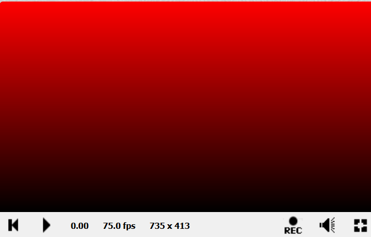

Соответственно, чтобы получить **горизонтальный градиент** нужно использовать `uv.x`.  

*А как сделать горизонтальный градиент от зеленого к белому?*

Например, вот так:
```c++
void mainImage( out vec4 fragColor, in vec2 fragCoord )
{
    vec2 uv = fragCoord / iResolution.xy; // Нормализуем координаты
    
    fragColor = vec4(uv.x, 1, uv.x, 1.0); 
}
```
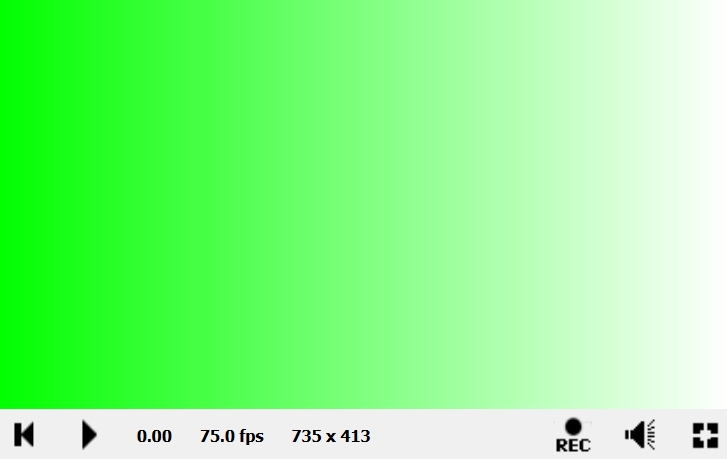

Как это работает?

**Зелёный цвет:** `(0.0, 1.0, 0.0)`  
**Белый цвет:** `(1.0, 1.0, 1.0)`

Изменения компонент цвета:
* **R компонент:** от 0.0 до 1.0

* **G компонент:** остаётся 1.0

* **B компонент:** от 0.0 до 1.0

А как получить градиент от зелёного к красному? Давайте посмотрим:  
**Зелёный цвет:** `(0.0, 1.0, 0.0)`  
**Красный цвет:** `(1.0, 0.0, 0.0)`

Изменения компонент цвета:
* **R компонент:** от 0.0 до 1.0

* **G компонент:** от 1.0 до 0.0

* **B компонент:** остаётся 0.0

```c++
void mainImage( out vec4 fragColor, in vec2 fragCoord )
{
    vec2 uv = fragCoord / iResolution.xy; // Нормализуем координаты
    
    fragColor = vec4(uv.x, 1.0 - uv.x, 0.0, 1.0); 
}
```
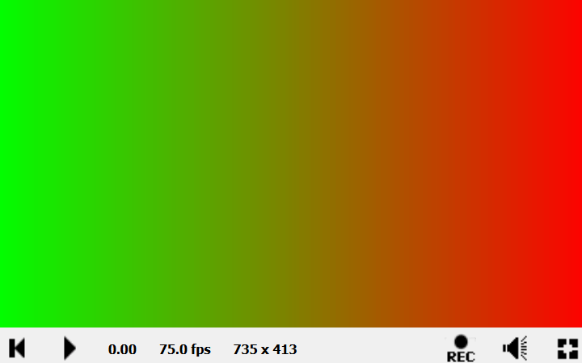

А как вот из такого цвета `color1 = (0.467, 0.553, 0.271)`   

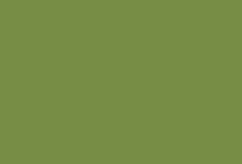

получить градиент вот в такой `color2 = (0.502, 0.392, 0.569)` ?

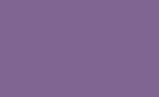

Задача, с одной стороны, непростая 🤔 

Посмотрим на компоненты:
* **R компонент:** от 0.467 до 0.502

* **G компонент:** от 0.553 до 0.392

* **B компонент:** от 0.271 до 0.569

При этом `uv.x` изменяется от 0.0 до 1.0.


Начнем с красного компонента. Как его плавно увеличить с 0.467 до 0.502?

**Во-первых,** нужно начать с 0.467.  

**Во-вторых,** каждый раз нужно добавлять разницу между 0.502 и 0.467, но не всю сразу, а как-то пропорционально.

**Для пропорциональности** введем какую-нибудь переменную, например **`t`**, которая будет показывать насколько мы продвинулись к желаемому цвету (*в случае красного компонента - 0.502*). Т.е.

* `t = 0.0` — исходное значение (0.467)
 
* `t = 1.0` — желаемое значение (0.502)

* `t = 0.5` — мы на середине пути

Для горизонтального градиента: `t = uv.x`

Теперь, если `A` — это исходное значение, а `B` — желаемое, то для красного компонента плавное изменение будет выглядеть вот так:

`Red = Red_A + (Red_B - Red_A) * t`

Подставим числа:  
`Red = 0.467 + (0.502 - 0.467) * t`  
`Red = 0.467 + 0.035 * t`

Теперь проверим:
* `t = 0.0` → `0.467 + 0.035 * 0 = 0.467` — исходное значение (0.467)  
 
* `t = 1.0` → `0.467 + 0.035 * 1 = 0.502` — желаемое значение (0.502)

* `t = 0.5` → `0.467 + 0.035 * 0.5 = 0.4845` — мы на середине пути

Посмотрим ещё раз:  
`Red   = 0.467 + (0.502 - 0.467) * t`

Раскроем скобки:  
`Red   = 0.467 + 0.502 * t - 0.467 * t`

Сгруппируем вот таким образом:  
`Red   = 0.467 - 0.467 * t  + 0.502 * t`

И вынесем 0.467:  
`Red   = 0.467 * (1 - t)  + 0.502 * t`

Теперь, если 0.467 — это `А`, а 0.502 — `B`, то формула будет вот такой:  
`Red   = A * (1 - t)  + B * t`

И будет справедливой для любой компоненты и даже для всего цвета, т.е.:  
`Color   = A * (1 - t)  + B * t`

**И это формула линейной интерполяции!** Она:
* Линейно зависит от параметра `t`

* Дает прямую линию между `A` и `B`

* Работает по принципу "взвешенного среднего"

Теперь вот такой код:
```c++
void mainImage( out vec4 fragColor, in vec2 fragCoord )
{
    vec2 uv = fragCoord.xy / iResolution.xy;
    
    vec3 A = vec3(0.467, 0.553, 0.271);
    vec3 B = vec3(0.502, 0.392, 0.569);
    float t = uv.x;
    // Линейная интерполяция:
    vec3 color = A * (1.0 - t) + B * t;
    
    fragColor = vec4(color, 1.0);
}
```
Даст вот такой результат:

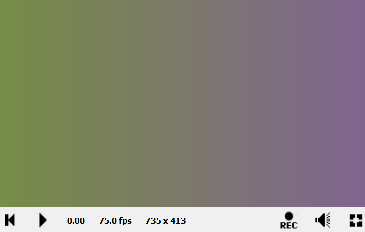

Попробуйте самостоятельно получить вот такой вертикальный градиент:

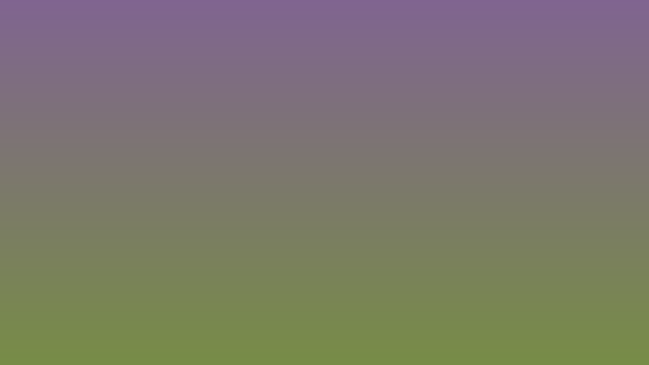

В OpenGL есть функция **`mix`**, которая и **реализует линейную интерполяцию**. Подробнее про эту функцию можно почитать, например, вот [здесь](https://registry.khronos.org/OpenGL-Refpages/gl4/html/mix.xhtml).

И с этой функцией код вертикального градиента будет выглядеть вот так:
```c++
void mainImage( out vec4 fragColor, in vec2 fragCoord )
{
    vec2 uv = fragCoord.xy / iResolution.xy;
    
    vec3 A = vec3(0.467, 0.553, 0.271);
    vec3 B = vec3(0.502, 0.392, 0.569);
    float t = uv.y;
    // Функция mix
    vec3 color = mix(A, B, t);
    
    fragColor = vec4(color, 1.0);
}
```

Градиенты могут быть разной направленности, в зависимости от того как и какие компоненты цвета изменяются.

Например, диагональный градиент может выглядеть вот так:
```c++
void mainImage( out vec4 fragColor, in vec2 fragCoord )
{
vec2 uv = fragCoord.xy / iResolution.xy;
    
    vec3 color1 = vec3(0.467, 0.553, 0.271);
    vec3 color2 = vec3(0.502, 0.392, 0.569);
    
    // Диагональ из левого нижнего в правый верхний
    float t = (uv.x + uv.y) / 2.0;
    
    vec3 color = mix(color1, color2, t);
    fragColor = vec4(color, 1.0);
}
```
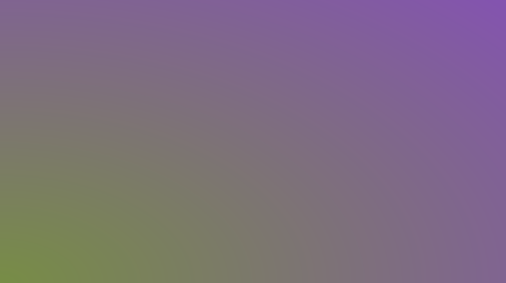

### 2. Отрисовка и анимация круга
Теперь перейдем к рисованию геометрических фигур и нарисуем вот такой круг:

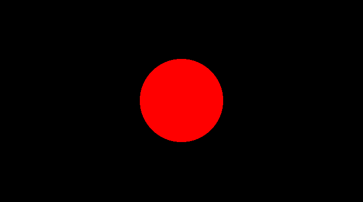

**Чтобы нарисовать круг**, нужно знать его **центр** и **радиус**.

При этом, для каждого пикселя нужно проверять находится ли он в круге. Если да, то задавать цвет круга, если нет - то фона.

**Как узнать принадлежит ли точка окружности?**  
1. Возьмём **координаты пикселя** (`uv`) и из них **вычтем центр окружности** (`center`).
2. Найдем **длину** этого вектора.
3. И посмотрим на это **расстояние**. Если оно **меньше радиуса**, то **пиксель в круге**.


Напишем вот такой код:
```C++
void mainImage( out vec4 fragColor, in vec2 fragCoord )
{
    vec2 uv = fragCoord / iResolution.xy;
    vec2 center = vec2(0.5); // Центр экрана
    float radius = 0.2;

    float dist = length(uv - center);
    vec3 color = (dist < radius) ? vec3(1.0, 0.0, 0.0) : vec3(0.0); // Красный, если внутри
    fragColor = vec4(color, 1.0);
}
```

**И... круг не получился.** 🤔 

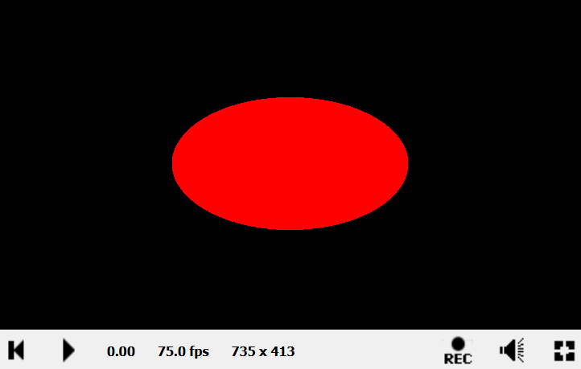

Получился какой-то овал. Почему?

Всё дело в соотношении сторон экрана (*на скриншоте - 735х413*). Если бы экран был квадратным, то такого растяжения по `x` не было бы. Значит, нужно это **учесть в коде**.

Какие есть варианты?  
1. Можно просто **учесть соотношение сторон**, т.е. 
```C++
void mainImage( out vec4 fragColor, in vec2 fragCoord )
{
    // Нормализуем координаты с учетом соотношения сторон
    vec2 uv = fragCoord / iResolution.xy;
    
    // Исправляем растяжение - делаем координаты квадратными
    uv.x *= iResolution.x / iResolution.y;
    
    vec2 center = vec2(0.5 * iResolution.x / iResolution.y, 0.5);
    float radius = 0.2;
    
    float dist = length(uv - center);
    vec3 color = (dist < radius) ? vec3(0.0, 1.0, 0.0) : vec3(0.0);
    
    fragColor = vec4(color, 1.0);
}
```
2. **Сместить диапазон координат пикселей**. Т.е. сейчас и `x`, и `y` в диапазоне от 0.0 до 1.0. И нулевые координаты находятся в нижнем левом углу. А чтобы сделать их в центра экрана, можно сдвинуть диапазон до `[-1.0; 1.0]`.

```C++
void mainImage( out vec4 fragColor, in vec2 fragCoord )
{
    // Центрированные координаты от -1 до 1 с исправлением растяжения
    vec2 uv = (2.0 * fragCoord - iResolution.xy) / iResolution.y;
    
    vec2 center = vec2(0.0); // Центр теперь в (0, 0)
    float radius = 0.4;
    
    float dist = length(uv - center);
    vec3 color = (dist < radius) ? vec3(1.0, 0.0, 0.0) : vec3(0.0);
    
    fragColor = vec4(color, 1.0);
}
```
> Делим на `iResolution.y` (высоту), чтобы гарантировать, что по вертикали у нас диапазон [-1, 1], а по горизонтали он автоматически маштабируется пропорционально.

И вот теперь этот круг в центре экрана. 

Теперь давайте добавим немного "жизни" и анимируем круг.

Что вообще такое анимация? Это **изменение параметров во времени**.  

В Shadertoy для этого используется **uniform-переменная `iTime`**, которая содержит время в секундах с начала выполнения шейдера.

Для плавного перемещения будем использовать синус:  
`sin(iTime * frequency) * amplitude;`

* `frequency` — скорость колебаний.

* `amplitude` — амплитуда движения.

Синус обеспечит плавное колебание в диапазоне от -1 до 1.
```C++
void mainImage( out vec4 fragColor, in vec2 fragCoord )
{
    // Нормализованные координаты с исправлением соотношения сторон
    vec2 uv = (2.0 * fragCoord - iResolution.xy) / iResolution.y;

    // Позиция круга по X
    float posX = 0.0; // Фиксированная позиция по центру
    
    // Движение вверх-вниз с использованием синуса
    float amplitude = 0.5; // Амплитуда движения (максимальное отклонение)
    float frequency = 2.0; // Скорость колебаний
    float posY = sin(iTime * frequency) * amplitude;
    
    vec2 center = vec2(posX, posY);
    float radius = 0.4;
    
    float dist = length(uv - center);
    vec3 color = (dist < radius) ? vec3(1.0, 0.0, 0.0) : vec3(0.0);
    
    fragColor = vec4(color, 1.0);
}
```


***А как сделать пульсацию?*** Всё тем же синусом. Только синус будет менять значение **радиуса круга**.

```C++
void mainImage( out vec4 fragColor, in vec2 fragCoord )
{
    // Центрированные координаты от -1 до 1 с исправлением растяжения
    vec2 uv = (2.0 * fragCoord - iResolution.xy) / iResolution.y;
    
    vec2 center = vec2(0.0); // Центр теперь в (0, 0)
    float amplitude = 0.1; // Амплитуда движения (максимальное отклонение)
    float frequency = 2.0; // Скорость колебаний
    // Радиус меняется от 0.3 до 0.5 по синусоиде от времени
    float radius = 0.4 + sin(iTime * frequency) * amplitude;
    
    float dist = length(uv - center);
    vec3 color = (dist < radius) ? vec3(1.0, 0.0, 0.0) : vec3(0.0);
    
    fragColor = vec4(color, 1.0);
}
```

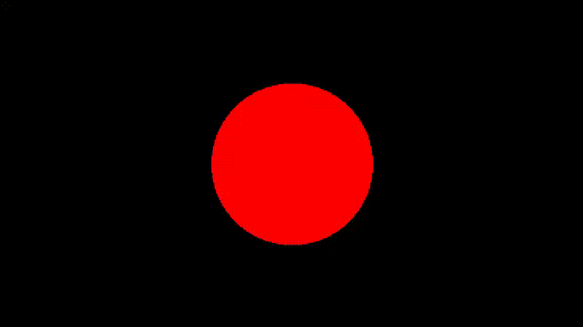

### 3. Взаимодействие с мышью
Добавим немного интерактивности с помощью `iMouse`.
```C++
void mainImage( out vec4 fragColor, in vec2 fragCoord )
{
    // Нормализованные координаты пикселя с исправлением растяжения
    vec2 uv = (2.0 * fragCoord - iResolution.xy) / iResolution.y;
    
    // Нормализованные координаты мыши
    vec2 mouse = (iMouse.z <= 0.0) ? vec2(0.0) : (2.0 * iMouse.xy - iResolution.xy) / iResolution.y;
    
    // Круг, следующий за курсором
    float dist = length(uv - mouse);
    float radius = 0.4;
    
    vec3 color = (dist < radius) ? vec3(0.2, 0.8, 0.2) : vec3(0.2);
    
    fragColor = vec4(color, 1.0);
}
```

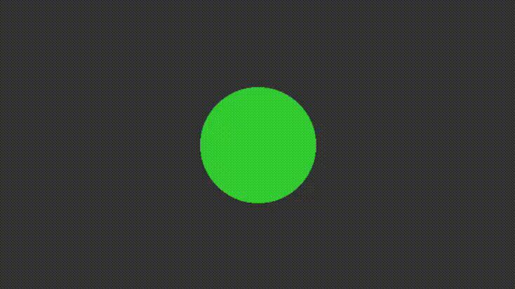

> `iMouse.z` — состояние левой кнопки мыши.


А как сделать так, чтобы круг менял цвет при захвате мышью? Можно, например, вот так:
```C++
void mainImage( out vec4 fragColor, in vec2 fragCoord )
{
    // Нормализованные координаты пикселя с исправлением растяжения
    vec2 uv = (2.0 * fragCoord - iResolution.xy) / iResolution.y;
    
    // Нормализованные координаты мыши
    vec2 mouse = (iMouse.z <= 0.0) ? vec2(0.0) : (2.0 * iMouse.xy - iResolution.xy) / iResolution.y;
    
    // Круг, следующий за курсором (или в центре если мышь не двигалась)
    float dist = length(uv - mouse);
    float radius = 0.4;
    
    vec3 circleColor = (iMouse.z > 0.0) ? vec3(1.0, 0.0, 0.0) : vec3(0.0, 1.0, 0.0);
    vec3 color = (dist < radius) ? circleColor : vec3(0.2);
    
    fragColor = vec4(color, 1.0);
}
```

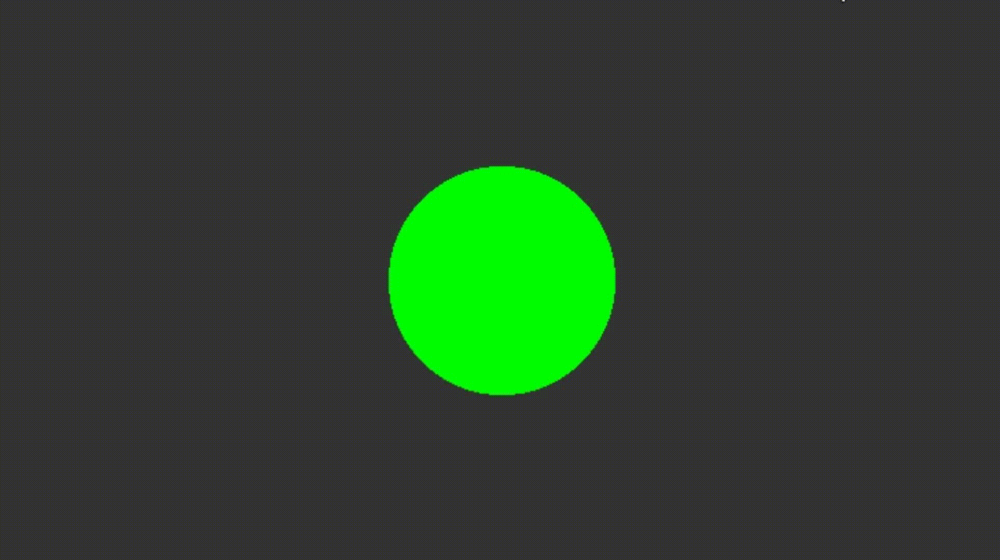


## Задания

### Задание 1. Градиент

Нарисуйте диагональный градиент из двух любых цветов.

### Задание 2. Отрисовка и анимация круга

Нарисуйте круг и анимируйте его ( например, влево-вправо или вверх-вниз или пульсация и т.д.).

### Задание 3. Взаимодействие с мышью

Нарисуйте геометрическую фигуру и добавьте интерактива (например, перетаскивание мышью и/или смена цвета при захвате)


## Контрольные вопросы

1. Почему необходимо нормализовать координаты `fragCoord`?

3. Как предотвратить превращение круга в эллипс при разных соотношениях сторон?

5. Какая разница между `iMouse.xy` и `iMouse.z`?

7. Почему фрагментные шейдеры считаются параллельными программами?

9. Что такое SDF и какие преимущества эта технология дает?
