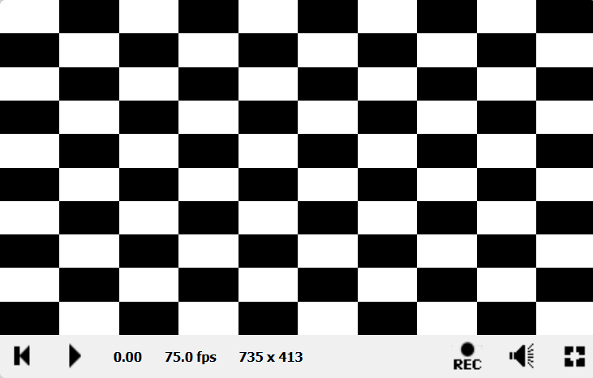
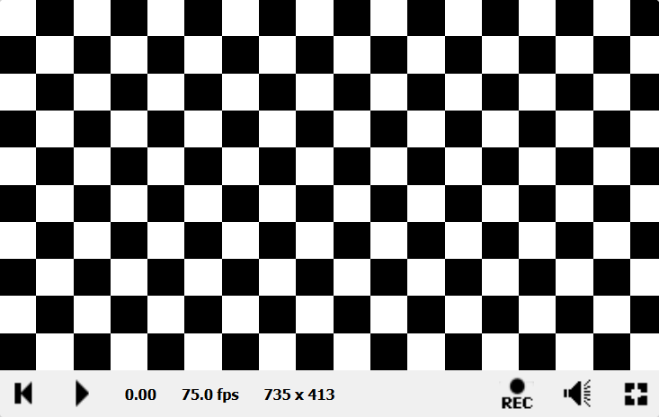
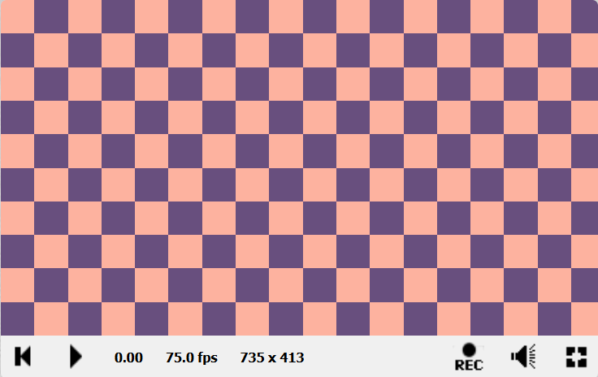
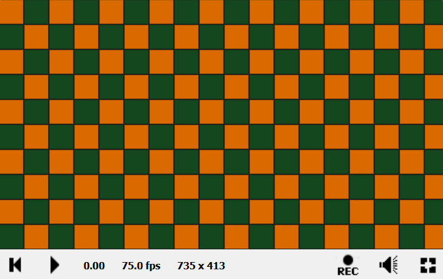
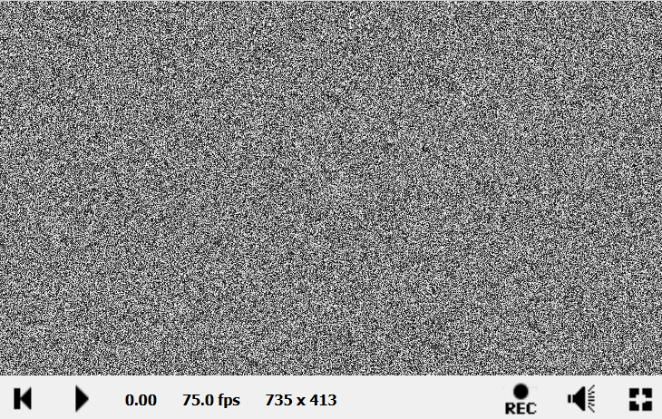
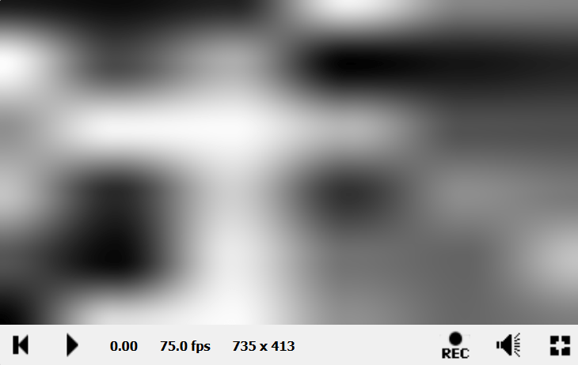

# ЛАБОРАТОРНАЯ РАБОТА №4. Процедурные текстуры и шумы
🔝 [Все лабораторные работы](../../README.md)  
🔙 [Рисование фигур: Построение геометрических примитивов и градиентов](../LR3/LR3.md)  
🔜 Введение в 3D: Raymarching и SDF
***

## Содержание

🔍 [Теория](#Теория)  
💡 [Полезные ссылки](#Полезные-ссылки)  
⚔️ [Учебная задача](#Учебная-задача)  
📋 [Задания](#Задания)  
🚩 [Контрольные вопросы](#Контрольные-вопросы)

*** 

## Теория

**Процедурные текстуры** — это текстуры, генерируемые программным путем с помощью математических функций, в отличие от загружаемых из файла изображений. Их преимущества: малый объем кода, бесшовность, бесконечное разрешение и параметризация.

**Регулярные паттерны:**
* Шахматная доска

* Полосы

* Круги, точки

* Решетки


**Случайные паттерны (шумы):**
* Шум Перлина (Perlin Noise)
 
* Шум Симлекса (Simplex Noise)

* Клеточный шум (Worley Noise)

* Фрактальный шум


**Шум (Noise)** — это псевдослучайная функция, обладающая определенными свойствами (псевдослучайность, повторяемость, гладкость, ограниченный частотный спектр). Является основным "строительным блоком" процедурных текстур.

* **Клеточный шум (Value Noise):** Создается путем интерполяции случайных значений (обычно в узлах целочисленной сетки).

1. Задается целочисленная сетка. Каждому узлу `(i, j)` присваивается псевдослучайное значение (например, с использованием хэш-функции).

2. Для произвольной точки `(x, y)` находятся 4 окружающих ее узла сетки.

3. Значения в этих узлах интерполируются (сначала по X, затем по Y) с использованием гладкой функции (например, `smoothstep` или полинома Эрмита `t*t*(3.0-2.0*t)`).


* **Gradient Noise (шум Перлина)**: Усовершенствованная версия, где в узлах сетки задаются не значения, а псевдослучайные градиенты (векторы). Значение в точке определяется скалярным произведением градиента и вектором смещения от узла до точки. Дает более естественный, не "блочный" вид.

* **Фрактальный шум (Fractal Brownian Motion - fBm)**: Техника для создания сложных, детализированных шумов путем суммирования нескольких октав простого шума.  
`fBm(p) = noise(p) + 0.5 * noise(2*p) + 0.25 * noise(4*p) + ...`  
Каждая последующая октава имеет удвоенную частоту (вдвое меньшую амплитуду).


## Полезные ссылки

1. [Официальный сайт OpenGL](https://www.opengl.org/)
2. [Документация ShaderToy](https://www.shadertoy.com/howto)
3. [Старенькая, но вполне полезная статья на хабре по шейдерам на ShaderToy](https://habr.com/ru/articles/333002/)

## Учебная задача


### Регулярные паттерны

Начнём с шахматной доски:
```c++
void mainImage( out vec4 fragColor, in vec2 fragCoord )
{
    vec2 uv = fragCoord / iResolution.xy;
    uv *= 10.0; // Масштабируем для получения большего количества клеток
    
    // Создаем шахматный паттерн
    float chessboard = mod(floor(uv.x) + floor(uv.y), 2.0);
    vec3 color = vec3(chessboard);
    
    fragColor = vec4(color, 1.0);
}
```


> 10 клеток по вертикали и 10 - по горизонтали.

Как это получилось?

**Во-первых,** после нормализации (`uv = fragCoord / iResolution.xy;`) координаты пикселей находятся в диапазоне `[0; 1]`.  

**Во-вторых,** увеличиваем диапазон в 10 раз (`uv *= 10.0;`) и теперь координаты в диапазоне `[0; 10]`. Это значит, что мы создадим 10×10 = 100 клеток на всей доске.

**В-третьих,** сам шахматный паттерн `mod(floor(uv.x) + floor(uv.y), 2.0);`, в котором функция `floor` - возвращает целую часть числа, а `mod` - это остаток от деления.


Например, если `uv = (1.2, 2.7)`:
* `floor(uv.x) = floor(1.2) = 1`
* `floor(uv.y) = floor(2.7) = 2`
* `1 + 2 = 3`

* `mod(3, 2.0) = 1 → белая клетка`

А если, например, `uv = (1.2, 3.7)`:
* `floor(uv.x) = 1`
* `floor(uv.y) = 3`
* `1 + 3 = 4`

* `mod(4, 2.0) = 0 → черная клетка`


Т.е. **`floor`** даёт координаты сетки, а **остаток от деления на два** даёт шахматный порядок: 

* Когда сумма координат **четная** → `mod(..., 2.0) = 0` → черный цвет
* Когда сумма координат **нечетная** → `mod(..., 2.0) = 1` → белый цвет

**Но на скриншоте не квадраты, а прямоугольники** 🤔 

Проблема в соотношении сторон. Нужно это учесть:
```C++
void mainImage( out vec4 fragColor, in vec2 fragCoord )
{
    vec2 uv = fragCoord / iResolution.xy;
    uv.x *= iResolution.x / iResolution.y;
    uv *= 10.0; // Масштабируем для получения большего количества клеток
    
    // Создаем шахматный паттерн
    float chessboard = mod(floor(uv.x) + floor(uv.y), 2.0);
    vec3 color = vec3(chessboard);
    
    fragColor = vec4(color, 1.0);
}
```


> И получаются **честные квадраты**. Только меняется их **количество**. **По вертикали** их всё также **10**, а вот **по горизонтали** - уже **больше**.

Бело-черная клетка получается из-за того, что цвет формируется либо только из нулей (это черный цвет), либо только из единиц (это белый цвет).

**А как сделать цветную шахматную доску?**

Можно добавить два цвета и смешивать их по переменной `chessboard`:
```C++
void mainImage( out vec4 fragColor, in vec2 fragCoord )
{
    vec2 uv = fragCoord / min(iResolution.x, iResolution.y);
    uv *= 10.0;
    
    float chessboard = mod(floor(uv.x) + floor(uv.y), 2.0);
    
    // Цвета вместо черного/белого
    vec3 color1 = vec3(0.408, 0.31, 0.494); 
    vec3 color2 = vec3(0.992, 0.698, 0.624);
    
    vec3 color = mix(color1, color2, chessboard);
    
    fragColor = vec4(color, 1.0);
}
```


> Так как `chessboard` либо **0**, либо **1**, то и цвета, по большому счёту, не смешиваются, а просто выбираются. Если **0**, то **первый цвет**, если **1**, то **второй цвет**.

А вот вариант с обводкой каждой клетки:
```c++
void mainImage( out vec4 fragColor, in vec2 fragCoord )
{
    vec2 uv = fragCoord / min(iResolution.x, iResolution.y);
    uv *= 10.0;
    
    vec2 cellUV = fract(uv);
    
    // Расстояние до ближайшего вертикального/горизонтального ребра
    float distToEdge = min(
        min(cellUV.x, 1.0 - cellUV.x), // расстояние до вертикальных границ
        min(cellUV.y, 1.0 - cellUV.y)  // расстояние до горизонтальных границ
    );
    
    // Плавные границы
    float border = 0.05;
    float cells = 1.0 - smoothstep(0.0, border, distToEdge);
    
    
    float pattern = mod(floor(uv.x) + floor(uv.y), 2.0);
    
    // Цвета
    vec3 color1 = vec3(0.078, 0.278, 0.118);
    vec3 color2 = vec3(0.855, 0.416, 0.0); 
    
    vec3 color = mix(color1, color2, pattern);
    color = mix(color, vec3(0.1), cells); // Добавляем черные границы
    
    fragColor = vec4(color, 1.0);
}
```


> Функция `fract` возвращает дробную часть числа, а функция `smoothstep` позволяет сгладить границы.

Концентрические круги:
```c++
void mainImage( out vec4 fragColor, in vec2 fragCoord )
{
    vec2 uv = (2.0 * fragCoord - iResolution.xy) / iResolution.y;
    
    // Создаем концентрические круги
    float dist = length(uv);
    float circles = sin(dist * 20.0); // Частота кругов
    
    // Преобразуем в четкие полосы
    circles = step(0.0, circles);
    vec3 color = vec3(circles);
    
    fragColor = vec4(color, 1.0);
}
```

> функция `step` своего рода **функция-"пеерключатель"**. Она проверяет: "**X меньше порогового значения?**" Если да — возвращает **0**, если нет — возвращает **1**.

Анимированные полосы:
```c++
void mainImage( out vec4 fragColor, in vec2 fragCoord )
{
    vec2 uv = fragCoord / iResolution.xy;
    
    // Создаем движущиеся полосы
    float stripes = sin(uv.x * 30.0 + iTime * 3.0);
    stripes = smoothstep(-0.3, 0.3, stripes); // Плавные края
    
    vec3 color = vec3(stripes * 0.8, stripes * 0.5, stripes);
    
    fragColor = vec4(color, 1.0);
}
```


### Шумы

Для процедурной генерации шумов нужен генератор псевдо-случайных чисел. В Shadertoy нет встроенного, поэтому сами напишем эту функцию:
```c++
// Функция для генерации псевдослучайного числа в диапазоне [0, 1)
// Принимает 2D-координату и возвращает "случайное" float значение.
float rand(vec2 uv) {
    return fract(sin(dot(uv.xy, vec2(12.9898, 78.233))) * 43758.5453123);
}

void mainImage(out vec4 fragColor, in vec2 fragCoord)
{
    // Нормализуем координаты пикселя в диапазон [0, 1]
    vec2 uv = fragCoord / iResolution.xy;
    
    // Генерируем случайное значение для текущей позиции (uv)
    float noise = rand(uv);
    
    // Используем это значение для цвета (оттенки серого)
    fragColor = vec4(noise, noise, noise, 1.0);
}
```



**Во-первых,** в Shadertoy можно создавать свои функции и помещать их нужно до функции `main`.

Функция `rand(vec2 uv)` - это хэш-функция, которая использует `sin`, `dot`(скалярное произведение векторов) и умножение на большое число для создания хаоса. А `fract` оставляет только дробную часть, обеспечивая результат от 0 до 1.

**Во-вторых,** результат функции `rand` присваивается всем цветовым каналам (R, G, B), что дает нам оттенки серого.

> Попробуйте изменить аргументы внутри функции `rand` (числа 12.9898, 78.233). Посмотрите, как меняется паттерн шума. Добавьте время (`iTime`) к координатам `uv` внутри вызова `rand(uv)` и посмотрите что происходит (не забудьте нажать на `play`)


Клеточный шум:
```c++
float rand(vec2 uv) {
    return fract(sin(dot(uv.xy, vec2(12.9898, 78.233))) * 43758.5453123);
}

void mainImage(out vec4 fragColor, in vec2 fragCoord)
{
    vec2 uv = fragCoord / iResolution.xy;
    
    // Масштабируем UV-координаты. Увеличивая число, мы уменьшаем "ячейки" шума.
    float scale = 5.0;
    uv *= scale;
    
    // Находим целочисленные координаты ячейки и дробные координаты внутри нее
    vec2 cell = floor(uv);
    vec2 insideCell = fract(uv);
    
    // Генерируем случайные значения для четырех углов текущей ячейки
    float bottomLeft = rand(cell);
    float bottomRight = rand(cell + vec2(1.0, 0.0));
    float topLeft = rand(cell + vec2(0.0, 1.0));
    float topRight = rand(cell + vec2(1.0, 1.0));
    
    // Интерполируем между углами. Сначала по оси X, затем по Y.
    // Используем smoothstep для плавного перехода.
    vec2 smoothCoord = smoothstep(0.0, 1.0, insideCell);
    
    float bottomMix = mix(bottomLeft, bottomRight, smoothCoord.x);
    float topMix = mix(topLeft, topRight, smoothCoord.x);
    float finalNoise = mix(bottomMix, topMix, smoothCoord.y);
    
    fragColor = vec4(finalNoise, finalNoise, finalNoise, 1.0);
}
```


**Клеточный шум (Value Noise)** создается в несколько шагов:
1. **Дискретизация:** Пространство разбивается на сетку (целочисленные координаты).

2. **Случайные значения:** В каждой вершине (узле) этой сетки генерируется случайное число (с помощью нашей функции rand).

3. **Интерполяция:** Для точки между узлами мы интерполируем значения соседних узлов. Мы используем плавную интерполяцию (например, smoothstep), чтобы избежать резких переходов.

## Задания

### Задание 1. Регулярные паттерны

Нарисуйте цветную шахматную доску.

### Задание 2. Шум

Реализуйте процедурную генерацию шума.


## Контрольные вопросы

1. Почему необходимо нормализовать координаты `fragCoord`?

3. Что делает функция `fract()`?

5. Приведите примеры регулярных паттернов.

7. Какими способами можно анимировать процедурные текстуры?

9. Что такое SDF и какие преимущества эта технология дает?
