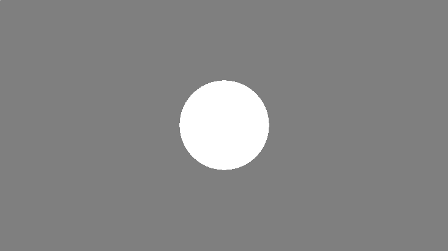
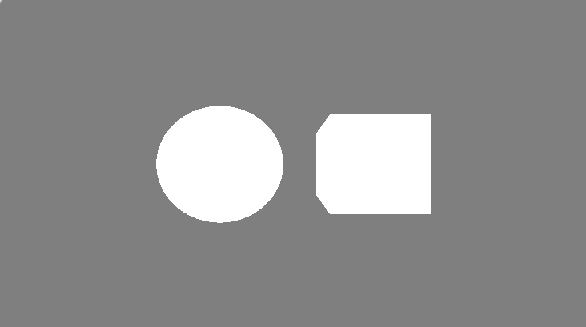
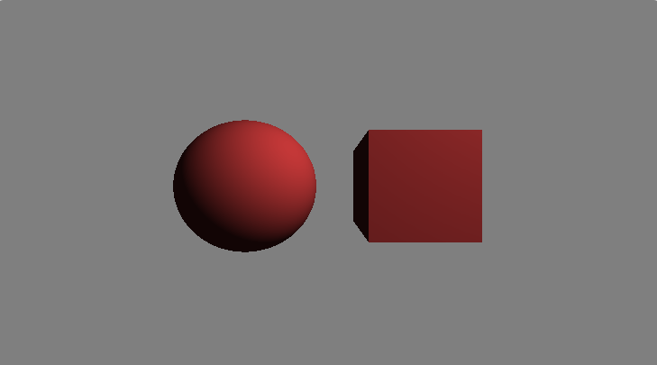

# ЛАБОРАТОРНАЯ РАБОТА №5. Введение в 3D: Raymarching и SDF
🔝 [Все лабораторные работы](../../README.md)  
🔙 [Процедурные текстуры и шумы](../LR4/LR4.md)  
***

## Содержание

🔍 [Теория](#Теория)  
💡 [Полезные ссылки](#Полезные-ссылки)  
⚔️ [Учебная задача](#Учебная-задача)  
📋 [Задания](#Задания)  
🚩 [Контрольные вопросы](#Контрольные-вопросы)

*** 

## Теория

**Raymarching** — это техника рендеринга, при которой для каждого пикселя экрана испускается луч из камеры. В отличие от классического Ray Tracing, где луч пересекается с аналитической геометрией, Raymarching «шагает» вдоль луча небольшими шагами, на каждом шаге проверяя расстояние до ближайшего объекта в сцене.

**SDF** — это функция, которая для любой точки пространства `p` возвращает **расстояние** до поверхности ближайшего объекта. «Знаковое» означает, что расстояние отрицательно *внутри* объекта и положительно *снаружи*. Ноль определяет саму поверхность.

* `SDF(p) > 0`: Точка `p` находится снаружи объекта.
 
* `SDF(p) = 0`: Точка `p` лежит на поверхности объекта.
 
* `SDF(p) < 0`: Точка `p` находится внутри объекта.

**Пример SDF сферы:**
```c++
float sdSphere(vec3 p, float radius) {
    return length(p) - radius;
}
```

Здесь `p` — точка в пространстве, а `radius` — радиус сферы. Центр сферы находится в начале координат (0,0,0).

**Основной цикл Raymarching выглядит так:**
1. **Инициализация**: Для каждого пикселя задаём начальную точку луча `ro` (ray origin) и направление `rd` (ray direction).
 
2. **Шаг**: Устанавливаем текущее расстояние `t = 0.0`.
 
5. **Цикл**: Повторяем для максимального числа шагов (например, 100):
    a. Вычисляем текущую позицию на луче: `p = ro + t * rd`.

    b. Вычисляем минимальное расстояние от точки `p` до всех объектов сцены с помощью SDF:  
      `d = sceneSDF(p).`

    c. **Проверка попадания:** Если `d < epsilon` (где `epsilon` — очень маленькое число, например, 0.001), значит, мы достигли поверхности. Возвращаем цвет объекта.
    
    d. **Продвижение вперед:** Если мы далеко от поверхности, мы можем безопасно шагнуть на расстояние `d: t += d`.
    
    e. **Проверка на промах:** Если `t` превысило максимальную дистанцию (`maxDist`), выходим из цикла — луч ушел в пустоту. Возвращаем цвет фона.


## Полезные ссылки

1. [Официальный сайт OpenGL](https://www.opengl.org/)
2. [Документация ShaderToy](https://www.shadertoy.com/howto)
3. [Старенькая, но вполне полезная статья на хабре по шейдерам на ShaderToy](https://habr.com/ru/articles/333002/)

## Учебная задача

1. Создайте новый шейдер и в функции `main` получите UV-координаты, нормализованные к диапазону [-1, 1], с учетом соотношения сторон.

```c++
    vec2 uv = (fragCoord * 2.0 - iResolution.xy) / iResolution.y;
```

2. Определите начало луча (`ro`) и его направление (`rd`). Пока сделаем камеру простой.
```c++
    vec3 ro = vec3(0.0, 0.0, -3.0); // Камера отодвинута назад по Z
    vec3 rd = normalize(vec3(uv, 1.0)); // Направление луча
```
> Это тоже в функции `main`.

3. Реализуйте SDF для сферы
```c++
float sdSphere(vec3 p, float radius) {
    return length(p) - radius;
}
```
> Функцию определите выше функции `main`.

4. Создайте функцию `map` (или `sceneSDF`), которая описывает всю сцену. Пока это одна сфера.

```c++
float map(vec3 p) {
    return sdSphere(p, 1.0); // Сфера радиуса 1.0 в центре мира
}
```

5. Реализуйте сам алгоритм Raymarching в функции `raymarch`.

```c++

float raymarch(vec3 ro, vec3 rd) {
    float t = 0.0; // текущее расстояние вдоль луча
    for (int i = 0; i < 100; i++) {
        vec3 p = ro + t * rd;
        float d = map(p); // получаем расстояние до сцены
        if (d < 0.001) { // мы попали в поверхность!
            return t;
        }
        if (t > 100.0) { // луч улетел слишком далеко
            break;
        }
        t += d; // шагаем на расстояние, равное пройденному пути
    }
    return -1.0; // означает, что ничего не нашли
}
```
6. В `mainImage` вызовите `raymarch` и визуализируйте результат. Если функция вернула -1, закрасьте пиксель в цвет фона, иначе — в белый.

```c++
    float t = raymarch(ro, rd);
    vec3 col = vec3(0.5); // серый фон

    if (t > 0.0) {
        col = vec3(1.0); //  белый объект
    }

    fragColor = vec4(col, 1.0);
```

Полный код:
```c++
float sdSphere(vec3 p, float radius) {
    return length(p) - radius;
}

float map(vec3 p) {
    return sdSphere(p, 1.0); // Сфера радиуса 1.0 в центре мира
}

float raymarch(vec3 ro, vec3 rd) {
    float t = 0.0; // текущее расстояние вдоль луча
    for (int i = 0; i < 100; i++) {
        vec3 p = ro + t * rd;
        float d = map(p); // получаем расстояние до сцены
        if (d < 0.001) { // мы попали в поверхность!
            return t;
        }
        if (t > 100.0) { // луч улетел слишком далеко
            break;
        }
        t += d; // шагаем на расстояние, равное пройденному пути
    }
    return -1.0; // означает, что ничего не нашли
}

void mainImage( out vec4 fragColor, in vec2 fragCoord )
{
    vec2 uv = (fragCoord * 2.0 - iResolution.xy) / iResolution.y;

    vec3 ro = vec3(0.0, 0.0, -3.0); // Камера отодвинута назад по Z
    vec3 rd = normalize(vec3(uv, 1.0)); // Направление луча
    
    
    float t = raymarch(ro, rd);
    vec3 col = vec3(0.5); // серый фон

    if (t > 0.0) {
        col = vec3(1.0); // чбелый объект
    }

    fragColor = vec4(col, 1.0);
}
```
Получился белый круг на сером фоне:  



**А как нарисовать несколько объектов?**

1. Реализуйте SDF для куба (бокс).
```c++
float sdBox(vec3 p, vec3 b) { // b - половины размеров куба по осям
    vec3 q = abs(p) - b;
    return length(max(q, 0.0)) + min(max(q.x, max(q.y, q.z)), 0.0);
}
```
2. Измените функцию ``map``, чтобы она включала и сферу, и куб. Используйте оператор `min` для объединения объектов (луч попадет в ближайшую поверхность).

```c++
float map(vec3 p) {
    float sphere = sdSphere(p - vec3(-1.2, 0.0, 0.0), 1.0); // Сфера слева
    float box = sdBox(p - vec3(1.2, 0.0, 0.0), vec3(0.7)); // Куб справа
    return min(sphere, box);
}
```
Полный код:
```c++
float sdSphere(vec3 p, float radius) {
    return length(p) - radius;
}

float sdBox(vec3 p, vec3 b) { // b - половины размеров куба по осям
    vec3 q = abs(p) - b;
    return length(max(q, 0.0)) + min(max(q.x, max(q.y, q.z)), 0.0);
}

float map(vec3 p) {
    float sphere = sdSphere(p - vec3(-1.2, 0.0, 0.0), 1.0); // Сфера слева
    float box = sdBox(p - vec3(1.2, 0.0, 0.0), vec3(0.7)); // Куб справа
    return min(sphere, box);
}

float raymarch(vec3 ro, vec3 rd) {
    float t = 0.0; // текущее расстояние вдоль луча
    for (int i = 0; i < 100; i++) {
        vec3 p = ro + t * rd;
        float d = map(p); // получаем расстояние до сцены
        if (d < 0.001) { // мы попали в поверхность!
            return t;
        }
        if (t > 100.0) { // луч улетел слишком далеко
            break;
        }
        t += d; // шагаем на расстояние, равное пройденному пути
    }
    return -1.0; // означает, что ничего не нашли
}

void mainImage( out vec4 fragColor, in vec2 fragCoord )
{
    vec2 uv = (fragCoord * 2.0 - iResolution.xy) / iResolution.y;

    vec3 ro = vec3(0.0, 0.0, -3.0); // Камера отодвинута назад по Z
    vec3 rd = normalize(vec3(uv, 1.0)); // Направление луча
    
  
    float t = raymarch(ro, rd);
    vec3 col = vec3(0.5); // серый фон

    if (t > 0.0) {
        col = vec3(1.0); // белый объект
    }

    fragColor = vec4(col, 1.0);
}
```
Теперь на сцене два объекта:  


> *Почему квадрат так страно выглядит?* **Потому что это куб!** 🤔 В дальнейшем наложим тень на ту грань и это будет очевидно😃 

Сейчас объекты выглядят ***плоскими***. Добавим им **объём**. Для этого используются нормали. **Нормаль** — это вектор, перпендикулярный поверхности. Его можно приближенно вычислить с помощью градиента SDF (метод центральных разностей).

1. Добавьте функцию для вычисления нормалей:
```c++
vec3 calcNormal(vec3 p) {
    float eps = 0.001; // маленькое приращение
    vec2 h = vec2(eps, 0);
    return normalize(vec3(
        map(p + h.xyy) - map(p - h.xyy), // градиент по X
        map(p + h.yxy) - map(p - h.yxy), // градиент по Y
        map(p + h.yyx) - map(p - h.yyx)  // градиент по Z
    ));
}
```

2. Добавьте простую модель освещения (модель Фонга). 

Для этого в блоке `if (t > 0.0)` в `mainImage` нужно найти точку пересечения `p` и нормаль `n`.
```c++
if (t > 0.0) {
    vec3 p = ro + rd * t;
    vec3 n = calcNormal(p);
```

Затем задать позицию источника света:
```c++
vec3 lightPos = vec3(3.0, 3.0, -3.0);
```

И рассчитать компоненты освещения: диффузную (Lambert) и окружающую (ambient):
```c++
    vec3 lightDir = normalize(lightPos - p);
    float diff = max(dot(n, lightDir), 0.0); // диффузная составляющая
    vec3 ambient = vec3(0.1); // окружающее освещение

    col = vec3(0.7, 0.2, 0.2) * (ambient + diff); // красный материал
}
```
Полный код:
```c++
float sdSphere(vec3 p, float radius) {
    return length(p) - radius;
}

float sdBox(vec3 p, vec3 b) { // b - половины размеров куба по осям
    vec3 q = abs(p) - b;
    return length(max(q, 0.0)) + min(max(q.x, max(q.y, q.z)), 0.0);
}

float map(vec3 p) {
    float sphere = sdSphere(p - vec3(-1.2, 0.0, 0.0), 1.0); // Сфера слева
    float box = sdBox(p - vec3(1.2, 0.0, 0.0), vec3(0.7)); // Куб справа
    return min(sphere, box);
}

float raymarch(vec3 ro, vec3 rd) {
    float t = 0.0; // текущее расстояние вдоль луча
    for (int i = 0; i < 100; i++) {
        vec3 p = ro + t * rd;
        float d = map(p); // получаем расстояние до сцены
        if (d < 0.001) { // мы попали в поверхность!
            return t;
        }
        if (t > 100.0) { // луч улетел слишком далеко
            break;
        }
        t += d; // шагаем на расстояние, равное пройденному пути
    }
    return -1.0; // означает, что ничего не нашли
}

vec3 calcNormal(vec3 p) {
    float eps = 0.001; // маленькое приращение
    vec2 h = vec2(eps, 0);
    return normalize(vec3(
        map(p + h.xyy) - map(p - h.xyy), // градиент по X
        map(p + h.yxy) - map(p - h.yxy), // градиент по Y
        map(p + h.yyx) - map(p - h.yyx)  // градиент по Z
    ));
}

void mainImage( out vec4 fragColor, in vec2 fragCoord )
{
    vec2 uv = (fragCoord * 2.0 - iResolution.xy) / iResolution.y;

    vec3 ro = vec3(0.0, 0.0, -3.0); // Камера отодвинута назад по Z
    vec3 rd = normalize(vec3(uv, 1.0)); // Направление луча
    

    float t = raymarch(ro, rd);
    vec3 col = vec3(0.5); // серый фон

    if (t > 0.0) {
    vec3 p = ro + rd * t;
    vec3 n = calcNormal(p);
    
    vec3 lightPos = vec3(3.0, 3.0, -3.0);
    
    vec3 lightDir = normalize(lightPos - p);
    float diff = max(dot(n, lightDir), 0.0); // диффузная составляющая
    vec3 ambient = vec3(0.1); // окружающее освещение

    col = vec3(0.7, 0.2, 0.2) * (ambient + diff); // красный материал
    }

    fragColor = vec4(col, 1.0);
}
```
И вот такой результат:



> Теперь это точно куб 😀 

## Задания

### Задание 1. Одна SDF-фигура

Напишите алгоритм Raymarching и добавьте одну фигуру на сцену.


### Задание 2. Комбинирование сцен

Добавьте несколько фигур на сцену.

### Задание 3. Модель освещения

Добавьте модель освещения (например, модель Фонга), чтобы сделать фигуры на сцене объемными.


## Контрольные вопросы

1. Объясните, что возвращает SDF-функция для точки внутри, на поверхности и снаружи объекта.
 
3. Почему в цикле Raymarching мы можем шагать на расстояние, равное d (расстоянию до сцены)? Что гарантирует эта величина?
 
5. Как вычисляются нормали к поверхности в нашем алгоритме и для чего они нужны?
 
7. Что произойдет, если увеличить значение epsilon в проверке на попадание? А если уменьшить до нуля?

